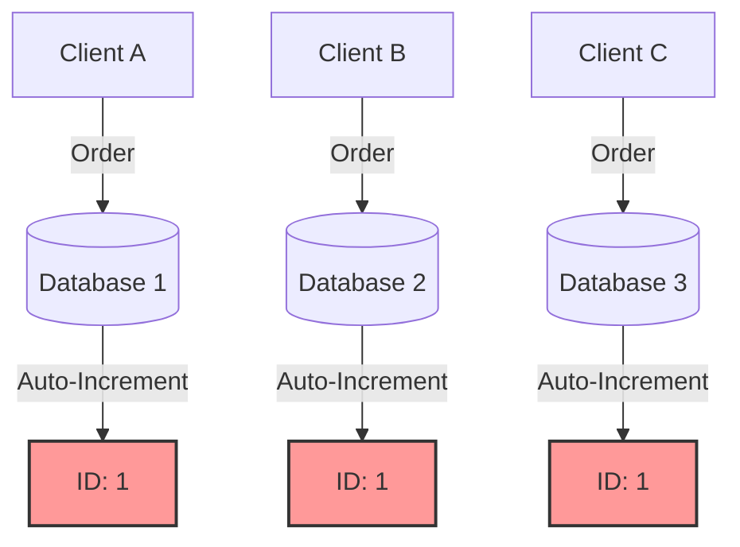
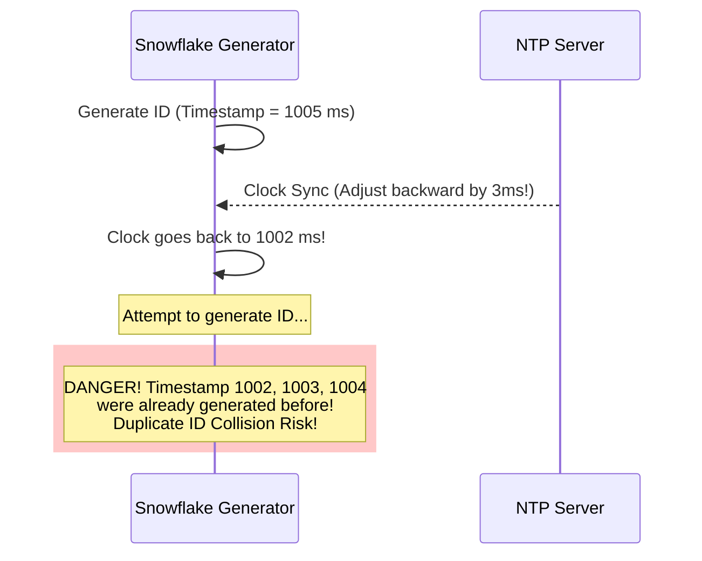
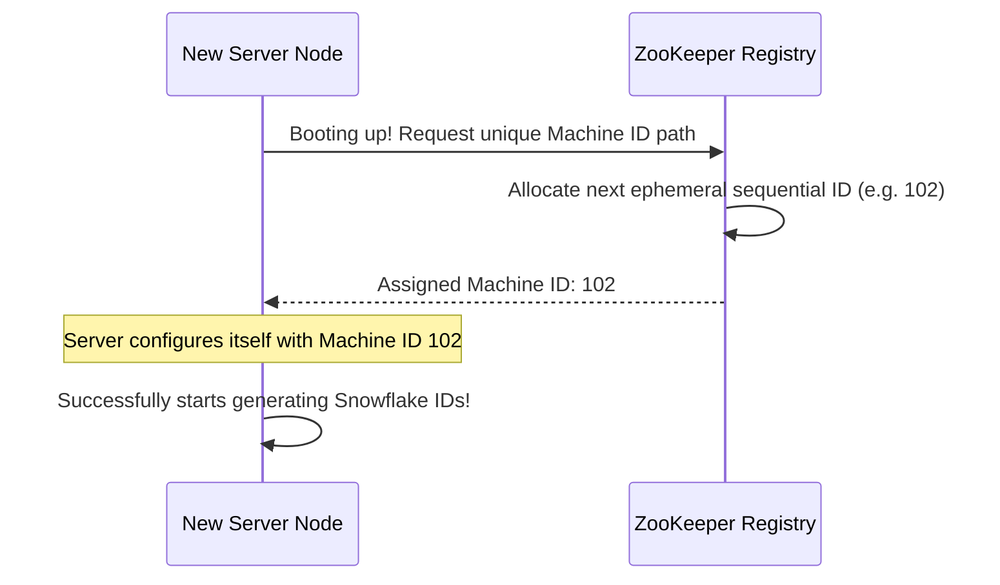

# Day 8: Distributed Unique ID Generator (Twitter Snowflake)

In a monolithic system, generating a unique ID is simple. We can rely on database auto-increment fields or a single-thread counter. However, in a **highly distributed system** running across multiple datacenters and hundreds of microservice instances, generating unique IDs becomes a complex challenge.

This guide explores why traditional methods fail, details the alternatives, and dives deep into the industry-standard **Twitter Snowflake Algorithm**.

---

## 1. The Core Problem: Why Auto-Increment Fails

Imagine you have a distributed e-commerce system with users placing orders globally. Your write requests are sharded across 5 different database instances to handle the traffic.



* **ID Collision:** If each database uses local auto-increment, both Database 1 and Database 2 will generate `ID: 1`, creating a major conflict.
* **Coordination Overhead:** Synchronizing databases to avoid overlaps using locks or network calls introduces high latency and defeats the purpose of horizontal scaling.

### System Requirements for an ID Generator
To design a production-grade ID generator, we need to meet the following constraints:
1. **Uniqueness:** Every single generated ID must be globally unique.
2. **Time-Sortable (Chronological):** IDs should be roughly sortable by time. If Order A is created after Order B, then `ID_A > ID_B` (helps in efficient database indexing and sorting).
3. **Compact Size:** The ID should be small. A **64-bit integer** is ideal because it fits easily into CPU registers, databases indexes, and network payloads. (Compared to a 128-bit UUID which is heavy).
4. **High Scale & Low Latency:** The system must generate **10,000+ IDs per second** per node, with less than **1ms latency** per ID. No single point of failure (SPOF).

---

## 2. Comparing Alternative Approaches

Before looking at Snowflake, let's understand the common alternatives and why they might not fit high-scale real-world requirements.

| Approach | Bit Size | Time-Sortable? | Latency / Dependency | Pros | Cons |
| :--- | :--- | :--- | :--- | :--- | :--- |
| **Multi-Master Replication** | 64-bit | ❌ No | Low (DB Dependent) | Simple, uses native DB features. | Hard to scale horizontally; adding new nodes disrupts the sequence configuration. |
| **UUID (v4)** | 128-bit | ❌ No (Random) | Extremely Low (Local) | No network coordination needed. | Too large (128-bit); non-sequential causes severe B-Tree database fragmentation and bad query performance. |
| **Ticket Server (Flickr)** | 64-bit | Yes | High (Network Call) | Centralized, simple to maintain. | Single Point of Failure (SPOF); network bottleneck. |
| **Twitter Snowflake** | 64-bit | ✅ Yes | **Zero Network Calls** (Local) | Fast, time-sortable, highly scalable, compact. | Requires clock synchronization; complex to assign machine IDs. |

### Deep-Dive into UUID and its Performance Downside
A UUID v4 is 128 bits of purely random numbers (e.g., `8f3e2b10-9c5d-4a11-b223-774f88e1a123`).
> [!WARNING]
> Because UUID v4 is completely random, when you insert rows with UUID primary keys into a relational database (like MySQL InnoDB with clustered indexes), **page splits** occur constantly.
> Since B-Trees want to keep data sorted, inserting a random UUID forces the database to split index pages to make room in the middle of the tree, destroying write performance.

---

## 3. The Gold Standard: Twitter Snowflake

Twitter developed **Snowflake** to solve these exact challenges. It is a **64-bit** unique ID generator where the ID is composed of multiple segments, each serving a specific purpose. 

Because the generation logic happens purely in-memory using basic bit shifts, it requires **zero network calls** during generation, allowing it to easily scale to millions of IDs per second.

### Bit Structure of a Snowflake ID

A 64-bit integer is structured as follows:

```
 1 bit   41 bits (Timestamp in ms)         10 bits (Node ID)    12 bits (Sequence)
+---+-------------------------------------+------------------+--------------+
| 0 | 01101011...0101                     | 00101    01001   | 000000000101 |
+---+-------------------------------------+------------------+--------------+
      Years from Epoch (69 years max)       DataCtr   Worker    4096 IDs/ms
                                              (5b)     (5b)
```

Let's break down each segment:

#### 1. Sign Bit (1 Bit) - Always `0`
* The highest bit (MSB) is kept as `0`. This ensures that the generated ID is always a **positive integer** in programming languages like Java, which only support signed 64-bit integers (`long`).

#### 2. Timestamp (41 Bits)
* This represents the milliseconds elapsed since a **custom epoch** (instead of the standard Unix Epoch of Jan 1, 1970).
* **Why Custom Epoch?** If we use Unix epoch, we waste bits on the past 50+ years. If we define our epoch as `May 1, 2026` (when our project started), `0` represents May 1, 2026.
* **Life Span:** With 41 bits, we can represent $2^{41}$ milliseconds, which is:
  $$\frac{2^{41} \text{ ms}}{1000 \times 60 \times 60 \times 24 \times 365} \approx 69.73 \text{ years}$$
  This means our system will work flawlessly without ID exhaustion for nearly 70 years!

#### 3. Machine / Node ID (10 Bits)
* This prevents collision when multiple servers generate IDs at the exact same millisecond.
* It is split into:
  * **Datacenter ID (5 Bits):** Up to $2^5 = 32$ different datacenters.
  * **Worker/Machine ID (5 Bits):** Up to $2^5 = 32$ servers per datacenter.
* Total nodes supported = $32 \times 32 = 1024$ independent worker machines.

#### 4. Sequence Number (12 Bits)
* For a specific worker node, if multiple IDs are generated within the *same millisecond*, this sequence counter increments.
* It ranges from `0` to $2^{12} - 1 = 4095$.
* It resets to `0` as soon as the system clock rolls over to the next millisecond.
* This allows **4,096 unique IDs per millisecond per node**.

---

## 4. The Mathematics and Scalability Limits

Let's calculate the theoretical throughput of a fully scaled Snowflake system:

* **Throughput per Node (per millisecond):** $4,096 \text{ IDs}$
* **Throughput per Node (per second):** 
  $$4,096 \text{ IDs/ms} \times 1,000 \text{ ms/s} = 4,096,000 \text{ (4.09 Million) IDs/second}$$
* **Global Maximum Throughput (all 1,024 nodes running at max capacity):**
  $$4,096,000 \text{ IDs/sec/node} \times 1,024 \text{ nodes} = 4,194,304,000 \text{ (4.19 Billion) IDs/second}$$

This is an astronomical number of write requests, far exceeding the requirements of even the largest global consumer applications like Twitter, Netflix, or Uber.

---

## 5. Advanced Challenges & Engineering Solutions

While Snowflake is highly elegant, it introduces several complex real-world operational challenges that system architects must solve.

### Challenge A: Clock Drift & NTP Adjustments
Snowflake relies entirely on the system clock (`System.currentTimeMillis()` in Java). However, server clocks are not perfectly accurate. They use **NTP (Network Time Protocol)** to sync with atomic clocks over the internet.
NTP can occasionally adjust the server's clock backward (Clock Drift). 



#### How to Solve Clock Drift:
1. **Clock-backwards Detection:** On every ID request, compare the current timestamp with the `lastTimestamp` generated.
2. **If `currentTimestamp < lastTimestamp`:**
   * **Option 1 (Soft Drift):** If the drift is very small (e.g., < 5ms), the generator can put the thread to sleep for the difference (`lastTimestamp - currentTimestamp`) until the clock catches up.
   * **Option 2 (Hard Drift):** If the drift is larger, throw a custom exception (`ClockMovedBackwardsException`) and fail-fast, routing traffic to other healthy nodes in the system.

---

### Challenge B: Dynamic Machine ID Allocation
How do our 1,024 server instances safely get assigned a unique 10-bit Machine ID (0 to 1023) at startup without manual configuration? Manual config is error-prone and doesn't work in containerized environments like Kubernetes where nodes are constantly destroyed and recreated.

#### The ZooKeeper / Consul Solution:
Modern Snowflake implementations use a coordination service like **ZooKeeper** or **Consul** to manage Node IDs dynamically:

1. When a new instance starts up, it registers itself under an ephemeral sequential node path in ZooKeeper (e.g., `/snowflake/nodes/node-`).
2. ZooKeeper returns a unique sequential number (e.g., node number `37`).
3. The instance reads this number, converts it into its 10-bit Node ID (`0000100101`), and starts generating IDs.
4. If the server crashes or goes offline, its ephemeral registration disappears from ZooKeeper, releasing that ID back into the pool for future servers to reuse.



---

## 6. How it Looks in Action: Bit Shift Logic (Concept)

How does a CPU actually build this ID in microseconds? It uses **Bitwise Operators** (`<<` for shift, `|` for Bitwise OR). The CPU performs this arithmetic in less than a nanosecond:

```java
// Conceptual Bit Shift Math:
long id = (timestampDiff << 22)   // Shift timestamp 22 bits to the left
        | (datacenterId << 17)   // Shift Datacenter ID 17 bits to the left
        | (workerId << 12)       // Shift Worker ID 12 bits to the left
        | sequence;              // Place sequence at the lowest 12 bits
```

### Let's trace a concrete example:
* **Custom Epoch Start:** `1775000000000` ms (Let's say, a point in 2026)
* **Current Time:** `1775000005000` ms (5 seconds later)
* **Timestamp Difference:** `5000` ms
* **Datacenter ID:** `5`
* **Worker ID:** `12`
* **Sequence:** `1`

The bit shift math would align the bits as:
1. `timestampDiff (5000)` shifted left by 22 bits.
2. `datacenterId (5)` shifted left by 17 bits.
3. `workerId (12)` shifted left by 12 bits.
4. `sequence (1)` at the end.
5. Bitwise `OR` compiles them into a single, beautiful 64-bit positive integer!

---

## 💡 Summary Key Takeaways

1. **Auto-increment** fails in distributed setups because nodes don't coordinate, risking collisions.
2. **UUIDs** are heavy (128-bit) and randomized, making them highly inefficient for clustered database indexes due to database fragmentation.
3. **Snowflake** uses a 64-bit layout providing:
   * **41 bits** for milliseconds since a custom epoch (approx. 70 years lifetime).
   * **10 bits** for datacenter/worker identifiers (supporting up to 1024 unique instances).
   * **12 bits** for an in-memory sequence counter (4,096 unique IDs per millisecond per server).
4. **Clock synchronization** (NTP clock drift) is the main caveat, solved by halting generation or throwing exceptions when time moves backward.
5. Dynamic node assignment can be delegated to coordination tools like **ZooKeeper** or **Consul** to make it cloud-native.
