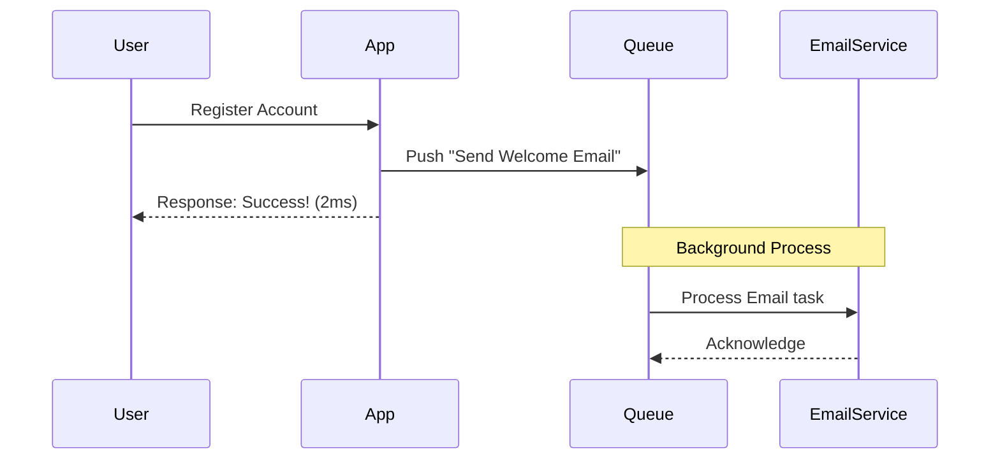
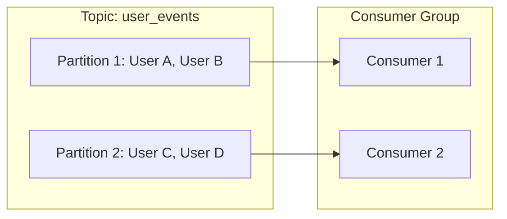

# Message Queues and Asynchronous Communication

Understanding how microservices communicate is fundamental to building scalable, fault-tolerant systems. This guide explores the transition from synchronous to asynchronous architectures.

---

## 1. Synchronous vs. Asynchronous Architecture

### Synchronous (Blocking)
In a synchronous system, the client makes a request and **waits (blocks)** for the server to process it and return a response.

> [!WARNING]  
> **The Bottleneck**: If your service depends on an external API (like a 3rd party Email Gateway) that is slow or down, your entire service becomes slow or unresponsive. Your threads hang waiting, consuming memory and preventing other requests from being handled.

### Asynchronous (Non-Blocking)
In an asynchronous system, the client sends a request and moves on. The execution happens "in the background."

---

## 2. Message Queues (High-Level Design)

At the heart of async communication is the **Message Queue (MQ)**. It follows the **Producer-Consumer Model**:

1.  **Producer**: The application that generates the task (e.g., the User Service).
2.  **Queue**: The buffer that stores the task until a worker is ready.
3.  **Consumer (Worker)**: The service that pulls the task and executes it (e.g., the Email Service).

**Benefits**:
- **Scalability**: You can add 10 more workers to handle a sudden spike in emails without slowing down the main "Register Account" flow.
- **Decoupling**: The main app doesn't need to know *how* or *when* the email is sent, only that it has been queued.

---

## 3. Push-based vs. Pull-based Mechanisms

There are two primary ways a worker gets tasks from a broker:

### Push-based (e.g., RabbitMQ)
The Broker (RabbitMQ) proactively **pushes** messages to the connected workers.
- **Complexity**: The Broker must manage which worker is busy and which is free.
- **Heartbeats**: Since the Broker manages the connection, it uses "heartbeats" to check if a worker is still alive. If a heartbeat is missed, the Broker stops pushing to that worker and re-queues the message.

### Pull-based (e.g., AWS SQS, BullMQ)
The Worker **polls** (asks) the Broker for new messages.
- **Polling**: Workers periodically ask, "Do you have work for me?"
- **Back-off Strategy**: If the queue is empty, workers wait longer before asking again (e.g., wait 1s, then 2s, then 4s) to avoid unnecessary network calls.
- **Retry Logic**: The worker is responsible for acknowledging once the task is done. If it fails, the message becomes visible again in the queue for another pull.

---

## 4. The FIFO Misconception

Most people think Message Queues are simple **First-In-First-Out (FIFO)** buffers. While true for a single worker, it breaks down with **parallelism**.

> [!CAUTION]  
> **The Ordering Issue**: If Task A (Created at 10:00) and Task B (Created at 10:01) are pulled by Worker 1 and Worker 2 simultaneously, Worker 2 might finish first if Task B is shorter. If these tasks are related (e.g., Change Password, then Login), processing them out of order can cause bugs.

---

## 5. Apache Kafka: Mastering Ordering & Parallelism

Kafka isn't just a queue; it's a **distributed log**. It solves the "Ordering vs. Parallelism" problem using **Partitions** and **Consumer Groups**.

### Partitions
A Topic in Kafka is divided into multiple **Partitions**.
- Kafka guarantees order **only within a single partition**.
- Messages with the same **Key** (e.g., `user_id: 123`) always go to the same partition.

### Consumer Groups
A group of consumers works together to read from a topic.
- **The Rule**: Each partition can be read by **only one consumer** in a group at any given time.
- This ensures that while we have 10 workers for speed, the updates for "User 123" are always handled by the same worker in the correct order.

> [!TIP]  
> Use Kafka when you need massive parallelism without losing the sequential order of events for specific entities.
