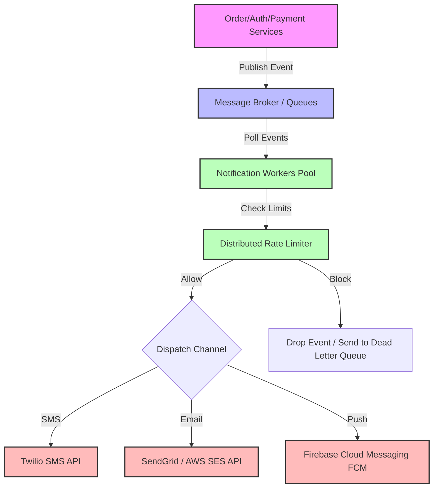

# Distributed Notification System Design (Architecture & Theory)

This document covers the high-level architecture, design considerations, and data flow for building a highly scalable, available, and rate-limited **Notification System**.

---

## 1. System Architecture Diagram

Below is the design diagram illustrating how events flow from core microservices, through a message broker, down to workers, rate limiters, and finally to third-party delivery channels (APIs).

Here is a high-quality visualization of the modern distributed notification system architecture:

---

## 2. Core Components & Concepts

### 1. Event-Driven Architecture (EDA) & Pub/Sub
*   **Decoupling:** Microservices (like Order or Payment Services) do not call the Notification System directly via synchronous HTTP requests. Instead, they announce state changes by publishing events (e.g., `"ORDER_PLACED"`, `"PAYMENT_COMPLETED"`).
*   **Loose Coupling:** The source services do not know or care who consumes these events. This prevents notification-sending failures from blocking core business flows (like taking orders).

### 2. Message Brokers & Queues (Kafka vs. RabbitMQ)
*   **Ingestion & Buffering:** During flash sales or massive campaigns, notifications surge. A message broker buffers this load.
*   **RabbitMQ:** Excellent for complex routing patterns, AMQP protocol, and fast task distribution. Messages are deleted once consumed.
*   **Apache Kafka:** A distributed replayable commit log. High throughput, excellent for event sourcing, data analytics pipelines, and multi-consumer pub/sub.

### 3. Notification Workers Pool
*   **Concurrency:** Workers run on independent thread pools (e.g., using `ExecutorService` in Java). They poll messages from queues asynchronously.
*   **Decoupled Channels:** Since third-party APIs have varying latencies (SMS, Email, and Push networks), workers handle slow network handshakes concurrently to avoid bottlenecking the broker.

### 4. Distributed Rate Limiter
*   **Spam Protection:** Prevents spamming users (e.g., max 3 messages per 5 seconds).
*   **Algorithm (Token Bucket):** Each user has a "bucket" with a maximum capacity of tokens. Every notification consumes a token. Tokens refill at a constant rate.
*   **Provider Quotas:** Prevents exceeding downstream API vendor limits (e.g., SMS providers throttling our keys).

### 5. Third-Party Gateway Integration
*   **SMS:** Twilio, Nexmo, or MessageBird.
*   **Email:** SendGrid, Mailchimp, or AWS SES.
*   **Push:** FCM (Firebase Cloud Messaging) for Android/Web and APNs for iOS. Using FCM wakes up devices efficiently without battery drainage.

---

## 3. Java Implementation Details

Our code implementation (`code/notification_system/`) simulates this entire system within a multi-threaded Java application:

1.  **`LinkedBlockingQueue`:** Used as our simulated in-memory message broker.
2.  **`NotificationEvent`:** Model capturing the payload, user ID, and channel (`EMAIL`, `SMS`, `PUSH`).
3.  **`RateLimiter`:** A thread-safe, custom **Token Bucket** algorithm implementation mapping users to their respective token capacities.
4.  **`NotificationWorker`:** Runnables running on an `ExecutorService` that consume events, check rate limits, and dispatch to channel senders.
5.  **`ChannelSender`:** Interfaces mapping to mock implementations representing Twilio (SMS), SendGrid (Email), and FCM (Push) with simulated network latencies.
