# 🐦 Twitter / X — Complete System Design & Architecture

> A production-grade, end-to-end system design of Twitter/X covering every layer:
> Clients → Edge → Microservices → Event Streaming → Storage → Platform Ops.

---

## 🎨 Visual System Architecture Diagrams

### 1. Overall Twitter / X Architecture Overview
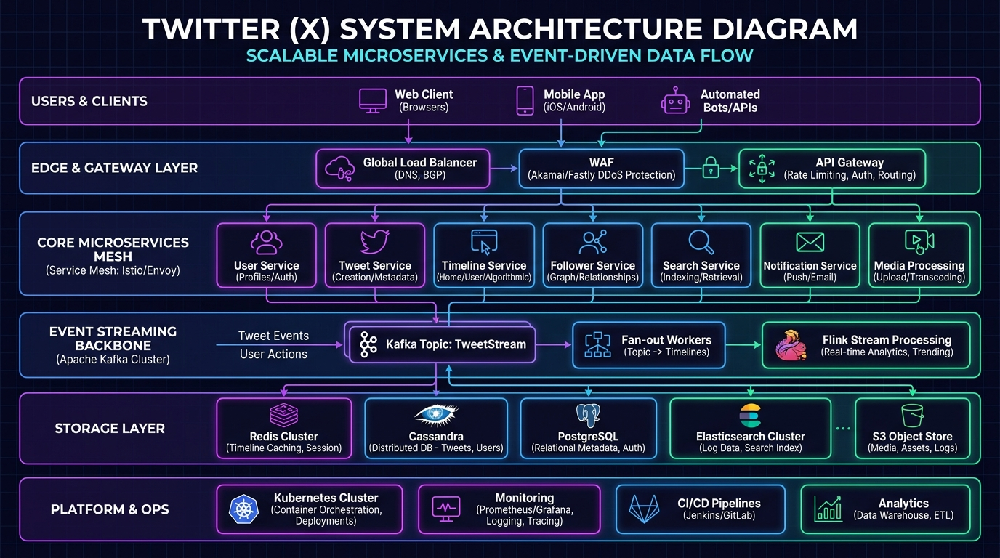

### 2. Tweet Ingestion & Hybrid Fan-out Architecture
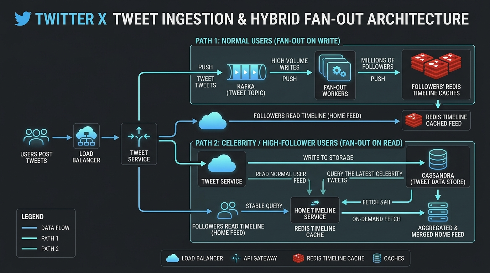

---

## 📋 Table of Contents

1. [High-Level Architecture Overview](#1-high-level-architecture-overview)
2. [Clients Layer](#2-clients-layer)
3. [Edge & API Layer](#3-edge--api-layer)
4. [Core Microservices](#4-core-microservices)
5. [Event Streaming Backbone](#5-event-streaming-backbone)
6. [Storage & Caching Layer](#6-storage--caching-layer)
7. [Platform & Ops (SRE)](#7-platform--ops-sre)
8. [Key Flows — Request Journeys](#8-key-flows--request-journeys)
   - [Post a Tweet](#81-post-a-tweet-flow)
   - [Timeline / Feed Generation](#82-timeline--feed-generation-flow)
   - [Follow a User](#83-follow-a-user-flow)
   - [Search a Tweet](#84-search-a-tweet-flow)
9. [Data Modeling](#9-data-modeling)
10. [Scalability & Fault Tolerance](#10-scalability--fault-tolerance)
11. [Numbers to Know (Back-of-Envelope)](#11-numbers-to-know-back-of-envelope)

---

## 1. High-Level Architecture Overview

The entire system is split into **6 horizontal layers**, each responsible for a specific concern:

```
┌─────────────────────────────────────────────────────────────┐
│                      CLIENTS                                │
│   Web App │ iOS/Android │ Public API │ Smart TV │ Bots      │
└──────────────────────┬──────────────────────────────────────┘
                       │
┌──────────────────────▼──────────────────────────────────────┐
│               EDGE & API LAYER (Multi-Region, Anycast)      │
│    Load Balancer → API Gateway → WebSocket/Push → WAF/DDoS  │
└──────────────────────┬──────────────────────────────────────┘
                       │
┌──────────────────────▼──────────────────────────────────────┐
│           CORE MICROSERVICES (gRPC + Service Mesh)          │
│  User&Auth │ Tweet │ Social Graph │ Timeline │ Notification  │
│  DM │ Media │ Search │ Ads&Ranking │ Service Mesh            │
└──────────────────────┬──────────────────────────────────────┘
                       │
┌──────────────────────▼──────────────────────────────────────┐
│          EVENT STREAMING BACKBONE (Kafka, exactly-once)     │
│  Kafka │ Fan-out Workers │ Stream Processing (Flink)         │
│  CDC/Debezium │ DLQ + Retry │ Schema Registry (Avro)         │
└──────────────────────┬──────────────────────────────────────┘
                       │
┌──────────────────────▼──────────────────────────────────────┐
│             STORAGE & CACHING (Sharded + Replicated)        │
│  Cassandra │ PostgreSQL │ Elasticsearch │ S3 │ Data Lake      │
│  Graph DB │ Vector Store │ Feature Store                     │
└──────────────────────┬──────────────────────────────────────┘
                       │
┌──────────────────────▼──────────────────────────────────────┐
│             PLATFORM & OPS (SRE – SLOs)                     │
│  Kubernetes │ Observability │ ML Ranking │ Trust & Safety    │
│  CI/CD Canary │ Vault & Secrets                              │
└─────────────────────────────────────────────────────────────┘
```

---

### Full Architecture Diagram

```mermaid
graph TB
    subgraph CLIENTS["👥 Clients"]
        WEB[Web App]
        MOB[iOS / Android]
        API_PUB[Public API]
        CDN_CLIENT[CDN / Edge]
        TV[Smart TV / Embeds]
        BOTS[3rd-party Bots]
    end

    subgraph EDGE["🌐 Edge & API Layer — Multi-Region Anycast"]
        LB[Load Balancer]
        APIGW[API Gateway<br/>AuthN/Z · Rate Limit]
        WS[WebSocket / Push]
        WAF[WAF + DDoS + Rate Limiter<br/>token-bucket · per-user-quotas]
    end

    subgraph MICRO["⚙️ Core Microservices — gRPC + Service Mesh"]
        UA[User & Auth]
        TS[Tweet Service]
        SG[Social Graph]
        TL[Timeline / Feed]
        NOTIF[Notifications]
        DM[DM Service]
        MEDIA[Media Service]
        SEARCH[Search & Trends]
        ADS[Ads & Ranking]
        SM[Service Mesh<br/>Envoy/Istio<br/>mTLS · retries · circuit breaking]
        MT[Media Transcoding<br/>FFMPEG / DASH builder]
    end

    subgraph STREAM["📡 Event Streaming Backbone — partitioned · exactly-once"]
        KAFKA[Kafka<br/>tweet / follow events]
        FAN[Fan-out Workers]
        FLINK[Stream Processing<br/>Flink]
        CDC[CDC / Debezium + Outbox]
        DLQ[DLQ + Retry Topics]
        SCHEMA[Schema Registry<br/>Avro]
    end

    subgraph STORAGE["🗄️ Storage & Caching — Sharded · Replicated"]
        ES[Elasticsearch<br/>Search Index]
        CASS[Cassandra<br/>Tweets · Timelines]
        PG[PostgreSQL<br/>Users · Graph]
        S3[S3 Object Store<br/>photos / Video]
        LAKE[Data Lake<br/>Analytics / ML]
        GRAPH[Graph DB<br/>FlockDB-like<br/>Follows / Blocks]
        VEC[Vector Store<br/>Embeddings / ANN]
        FS[Feature Store<br/>Online · offline party]
    end

    subgraph OPS["🛠️ Platform & Ops — SRE · SLOs"]
        K8S[Kubernetes]
        OBS[Observability]
        ML[ML Ranking]
        TS_OPS[Trust & Safety]
        CICD[CI/CD · Canary]
        VAULT[Vault & Secrets]
    end

    CLIENTS --> LB
    LB --> APIGW
    APIGW --> WS
    APIGW --> WAF
    WAF --> MICRO
    APIGW --> MICRO
    MICRO --> STREAM
    STREAM --> STORAGE
    STORAGE --> OPS
    MICRO --> OPS
```

---

## 2. Clients Layer

All traffic originates from one of these 5 client types:

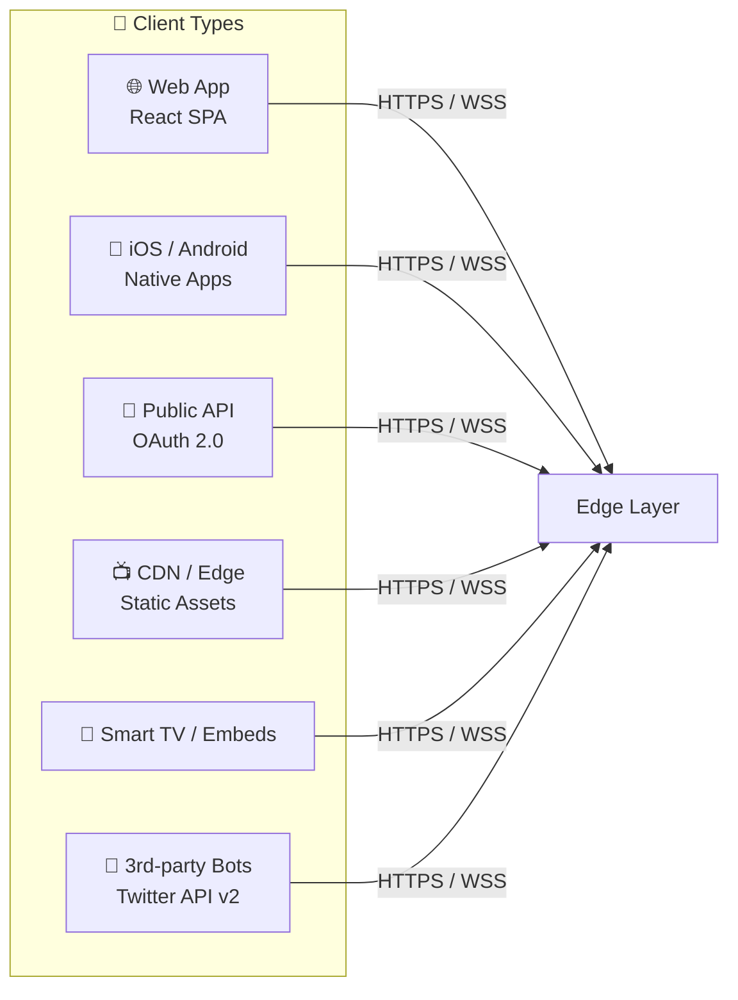

| Client | Protocol | Auth |
|--------|----------|------|
| Web App | HTTPS + WebSocket | Session Cookie / JWT |
| Mobile | HTTPS + HTTP/2 | OAuth 2.0 Bearer Token |
| Public API | HTTPS | OAuth 2.0 / API Key |
| Smart TV | HTTPS | Device Code Flow |
| Bots | HTTPS | App-only Bearer |

---

## 3. Edge & API Layer

This layer handles **all incoming traffic** before it reaches any microservice.

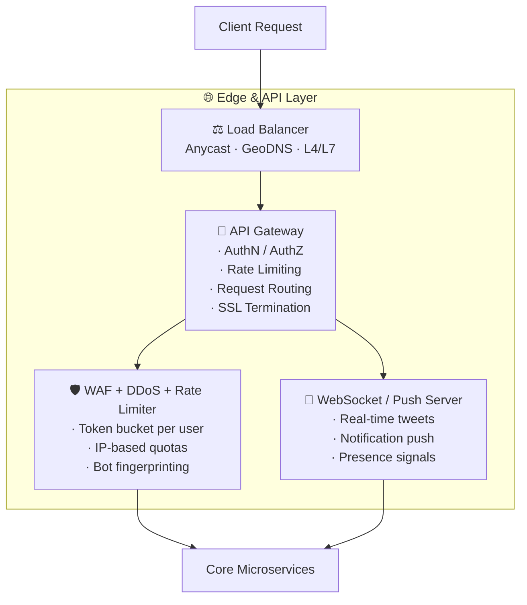

### Key Responsibilities

| Component | Responsibility |
|-----------|---------------|
| **Load Balancer** | Anycast routing, health checks, geographic failover |
| **API Gateway** | AuthN/Z, rate limiting, request routing, response caching |
| **WebSocket Server** | Persistent connections for real-time push (tweets, notifications) |
| **WAF / DDoS Limiter** | Block malicious traffic, token-bucket rate limiting, bot detection |

---

## 4. Core Microservices

All services communicate via **gRPC** over a **Service Mesh (Envoy/Istio)** with mTLS.

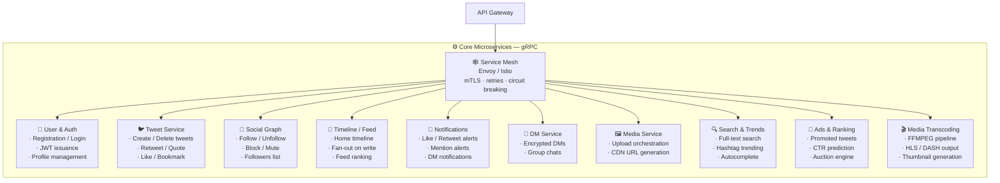

### Service Communication Pattern

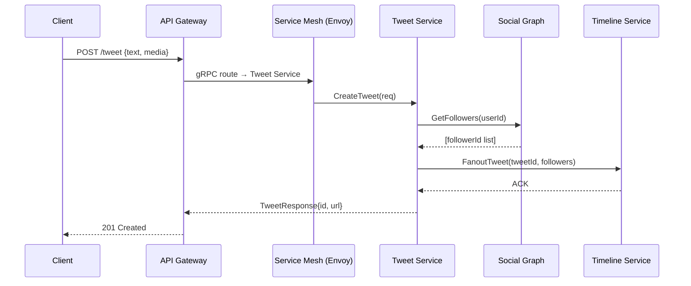

---

## 5. Event Streaming Backbone

The backbone is **Apache Kafka** — all state changes produce events, consumed asynchronously.

```mermaid
graph LR
    subgraph PRODUCERS["📤 Event Producers"]
        TS2[Tweet Service]
        SG2[Social Graph]
        UA2[User & Auth]
        MEDIA2[Media Service]
    end

    subgraph KAFKA_CLUSTER["📡 Kafka Cluster — Partitioned · Exactly-Once"]
        K_TWEET[Topic: tweet.created<br/>tweet.deleted<br/>tweet.liked]
        K_FOLLOW[Topic: user.followed<br/>user.unfollowed]
        K_MEDIA[Topic: media.uploaded<br/>media.transcoded]
        DLQ2[DLQ + Retry Topics]
        CDC2[CDC / Debezium + Outbox<br/>DB → Kafka change capture]
        SCHEMA2[Schema Registry<br/>Avro schemas]
    end

    subgraph CONSUMERS["📥 Event Consumers"]
        FAN2[Fan-out Workers<br/>Write to follower timelines]
        FLINK2[Flink Stream Processor<br/>· Trending detection<br/>· Analytics aggregation<br/>· Anomaly detection]
        SEARCH2[Search Indexer<br/>→ Elasticsearch]
        NOTIF2[Notification Sender]
        ML2[ML Feature Pipeline]
    end

    PRODUCERS --> KAFKA_CLUSTER
    KAFKA_CLUSTER --> CONSUMERS
```

### Why Kafka?

| Feature | Benefit for Twitter |
|---------|-------------------|
| **Partitioned Topics** | Scale horizontally — each partition handled by one consumer |
| **Exactly-Once Semantics** | No duplicate tweets in timelines |
| **Log Retention** | Replay events for ML training, debugging |
| **Consumer Groups** | Fan-out workers, Flink, Search indexer all consume same topic independently |
| **CDC + Outbox** | No dual-write problems — DB is source of truth |

---

## 6. Storage & Caching Layer

Different data needs → different databases (polyglot persistence).

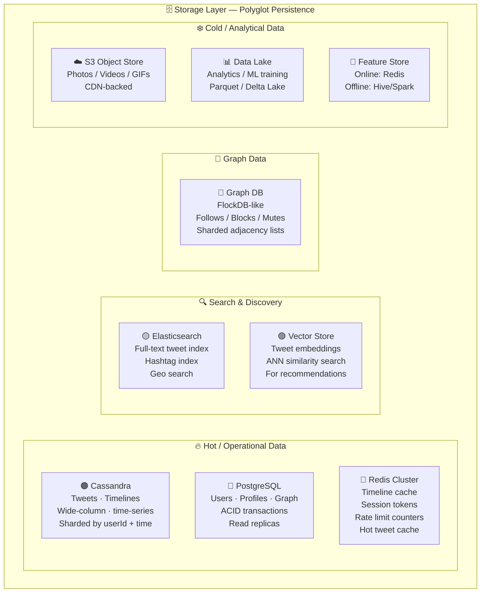

### Storage Decision Matrix

| Data Type | Database | Reason |
|-----------|----------|--------|
| Tweets | **Cassandra** | High write throughput, time-series, append-only |
| User Profiles | **PostgreSQL** | Relational, ACID, low volume |
| Timelines | **Cassandra + Redis** | Pre-computed fan-out cached in Redis |
| Follow Graph | **Graph DB (FlockDB)** | Adjacency list traversal at scale |
| Search Index | **Elasticsearch** | Inverted index, full-text, faceted search |
| Media Files | **S3 + CDN** | Object storage, geographically distributed |
| ML Features | **Feature Store** | Online serving + offline training |
| Embeddings | **Vector Store (FAISS)** | ANN search for recommendations |

---

### Caching Strategy

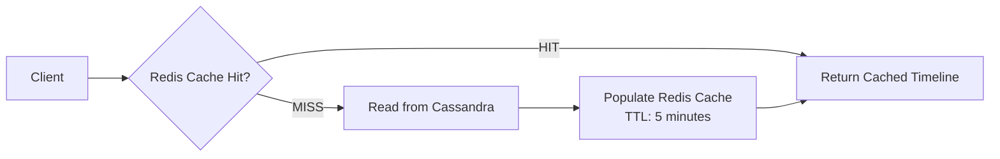

---

## 7. Platform & Ops (SRE)

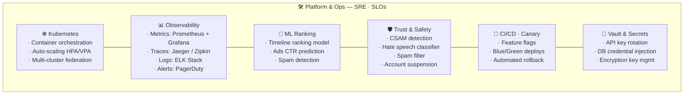

---

## 8. Key Flows — Request Journeys

### 8.1 Post a Tweet Flow

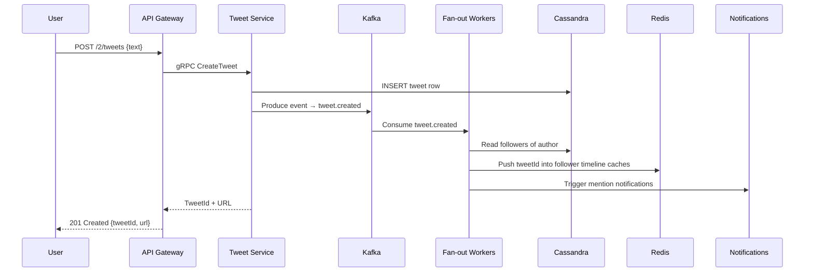

> **Fan-out on Write** strategy: Pre-compute timelines for all followers so reads are O(1).  
> Exception: **Celebrity users (>1M followers)** → Fan-out on Read to avoid hot partitions.

---

### 8.2 Timeline / Feed Generation Flow

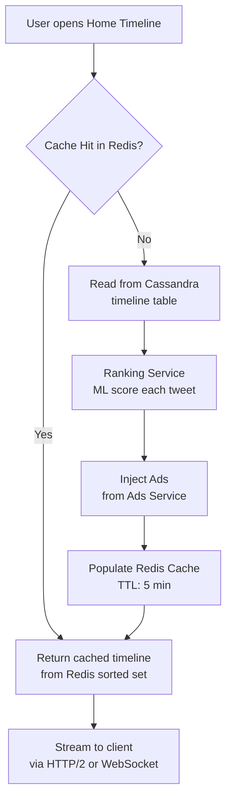

---

### 8.3 Follow a User Flow

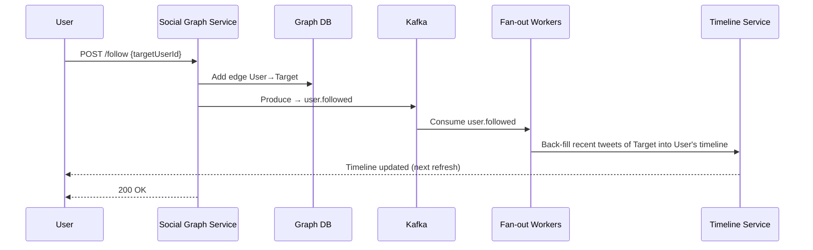

---

### 8.4 Search a Tweet Flow

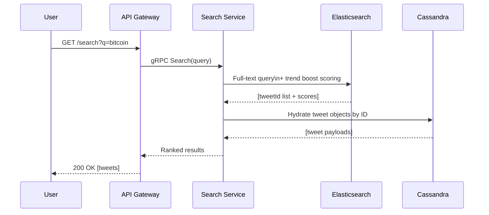

---

## 9. Data Modeling

### Tweet Table (Cassandra)

```sql
TABLE tweets (
  tweet_id      TIMEUUID,       -- sorted by time globally
  author_id     UUID,
  text          TEXT,
  media_ids     LIST<UUID>,
  reply_to_id   UUID,
  like_count    COUNTER,
  retweet_count COUNTER,
  created_at    TIMESTAMP,
  PRIMARY KEY ((author_id), created_at, tweet_id)
) WITH CLUSTERING ORDER BY (created_at DESC);
```

### Timeline Table (Cassandra — Fan-out materialized view)

```sql
TABLE user_timeline (
  user_id       UUID,           -- the owner of the timeline
  tweet_id      TIMEUUID,       -- sorted newest-first
  author_id     UUID,
  score         FLOAT,          -- ML ranking score
  PRIMARY KEY ((user_id), score, tweet_id)
) WITH CLUSTERING ORDER BY (score DESC, tweet_id DESC);
```

### Social Graph (Graph DB)

```
NODES:  User {userId, username, verified}
EDGES:  FOLLOWS  (User → User)  {since: timestamp}
        BLOCKS   (User → User)
        MUTES    (User → User)
```

### Entity Relationship (High Level)

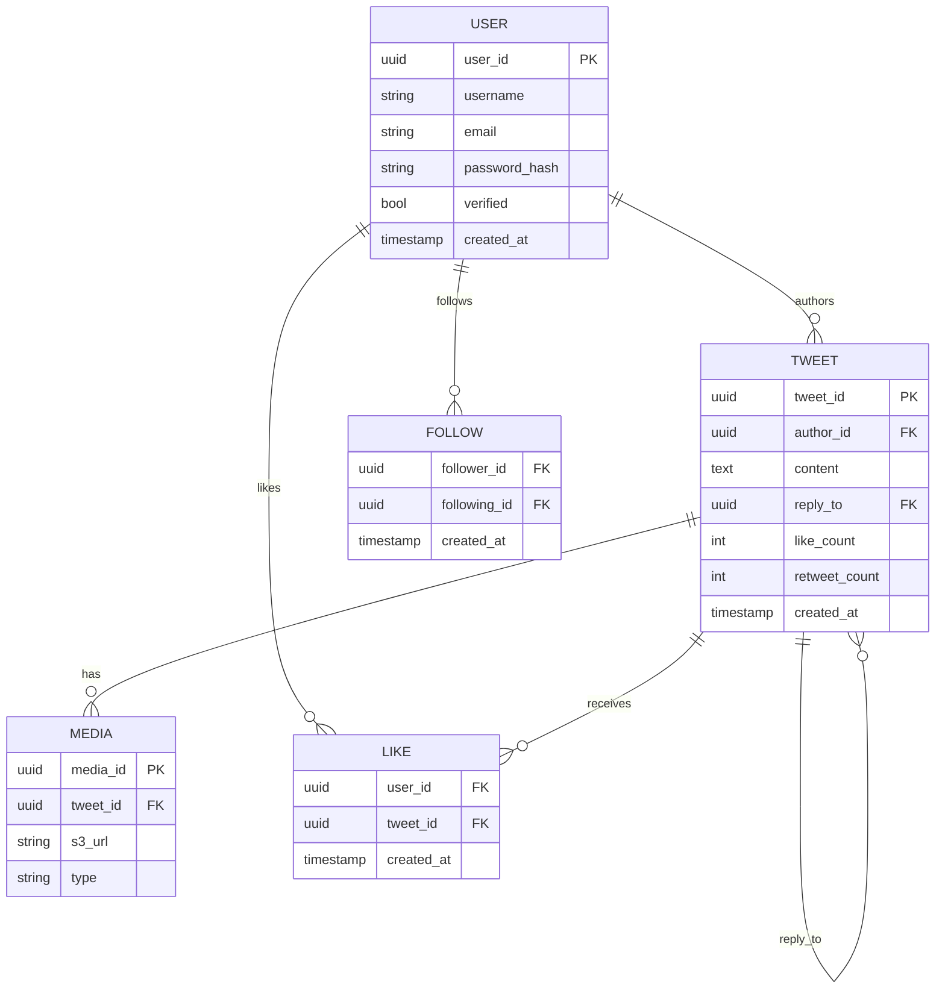

---

## 10. Scalability & Fault Tolerance

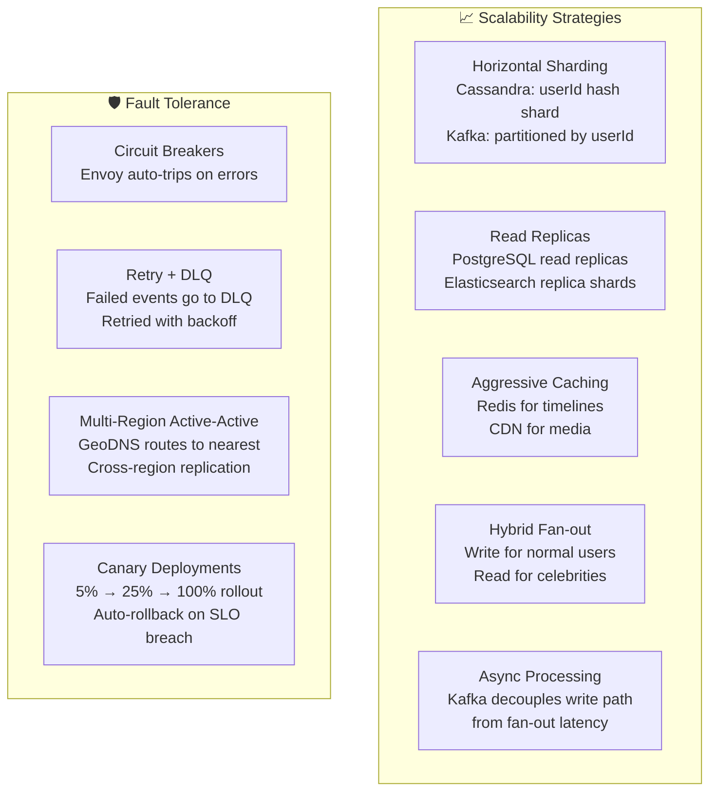

### SLOs (Service Level Objectives)

| Metric | Target |
|--------|--------|
| Timeline load p99 latency | < 200ms |
| Tweet post latency p99 | < 500ms |
| Search latency p99 | < 300ms |
| Availability | 99.99% (52 min/year downtime) |
| Fan-out lag | < 5 seconds for 99% of users |

---

## 11. Numbers to Know (Back-of-Envelope)

| Metric | Estimate |
|--------|----------|
| **DAU** | ~250 million |
| **Tweets per day** | ~500 million |
| **Tweets per second (avg)** | ~5,800 TPS |
| **Tweets per second (peak)** | ~150,000 TPS |
| **Timeline reads per second** | ~300,000 RPS |
| **Avg followers per user** | ~200 |
| **Fan-out writes per tweet** | 200 × 5,800 = ~1.1M writes/sec |
| **Media storage growth** | ~100 TB/day |
| **Kafka events per day** | ~10 billion |

### Storage Estimation

```
Tweets per day:    500M × 300 bytes      = 150 GB/day
Media per day:     ~100 TB/day (photos/video)
Timeline cache:    ~1 KB per user × 250M = 250 GB (Redis)
Total 5-year data: ~200 PB
```

---

## 🗺️ Full System Map (Summary)

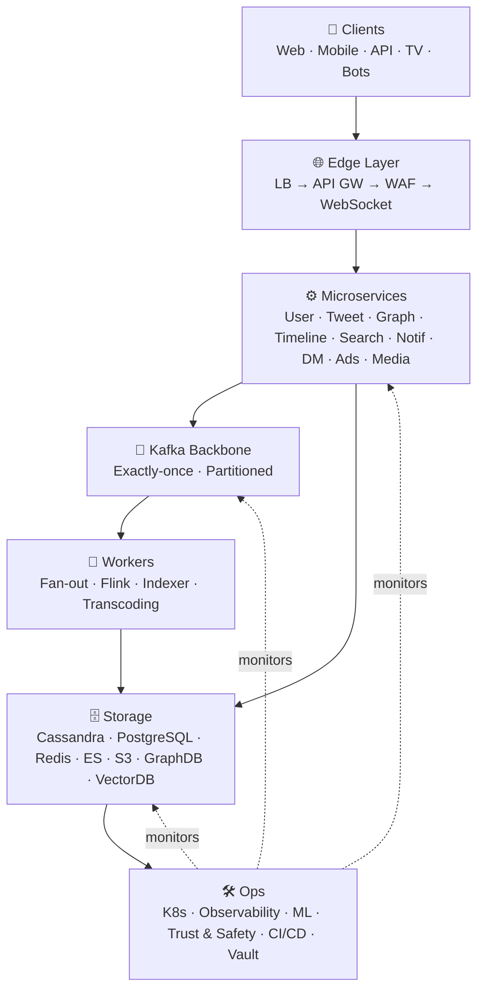

---

> 📌 **Key Takeaway**: Twitter/X is fundamentally a **fan-out problem** at scale.
> The entire architecture — Kafka, Cassandra, Redis, hybrid fan-out — exists to solve
> the challenge of delivering 1 tweet to potentially millions of followers in near-real-time,
> while maintaining sub-200ms read latency for home timelines.
