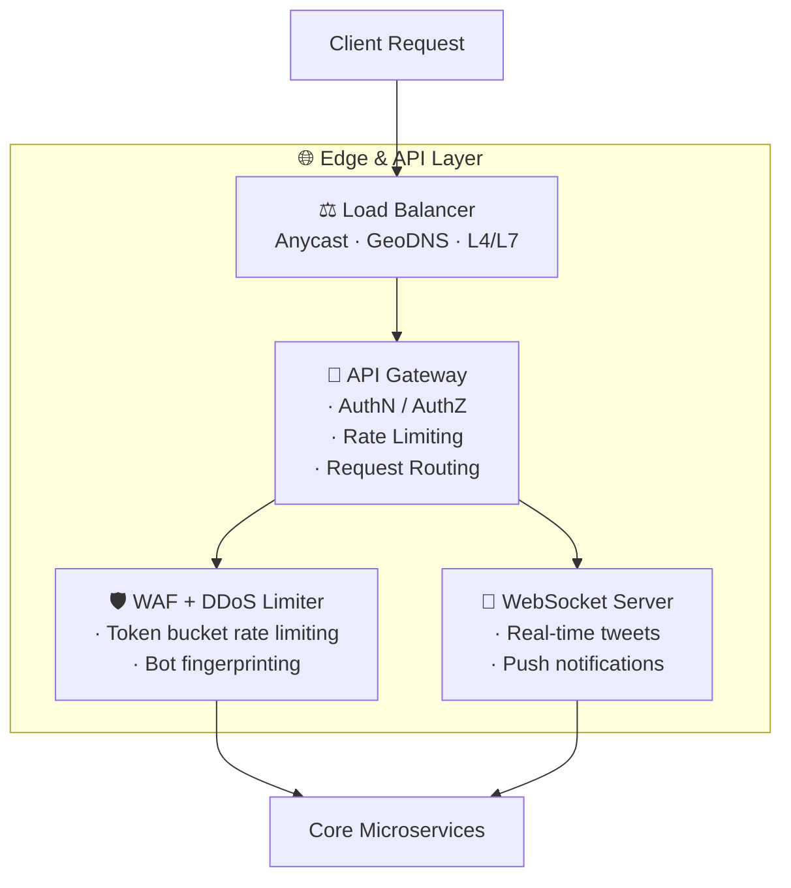
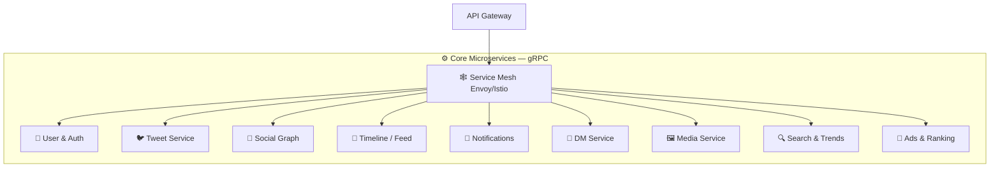
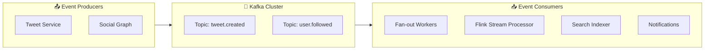
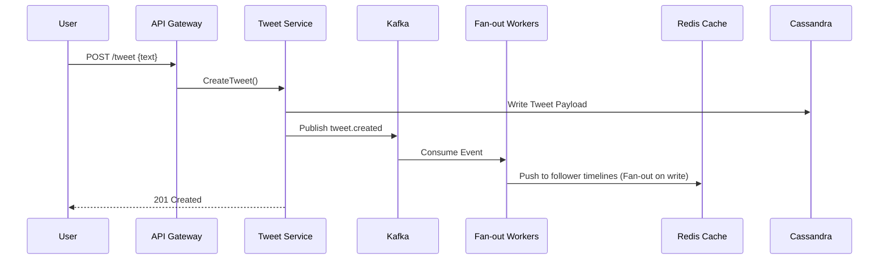

# 🐦 Twitter / X — System Design & Architecture

> Complete system design documentation with HD visual architecture diagrams, Mermaid charts, and in-depth explanations.

---

## 🎨 Visual System Architecture Diagrams

### 1. Overall Twitter / X Architecture Overview


### 2. Tweet Ingestion & Hybrid Fan-out Architecture


---

## 📋 Table of Contents

1. [High-Level Architecture Overview](#1-high-level-architecture-overview)
2. [Clients Layer](#2-clients-layer)
3. [Edge & API Layer](#3-edge--api-layer)
4. [Core Microservices](#4-core-microservices)
5. [Event Streaming Backbone](#5-event-streaming-backbone)
6. [Storage & Caching Layer](#6-storage--caching-layer)
7. [Platform & Ops (SRE)](#7-platform--ops-sre)
8. [Key Flows — Request Journeys](#8-key-flows--request-journeys)
9. [Data Modeling](#9-data-modeling)
10. [Scalability & Fault Tolerance](#10-scalability--fault-tolerance)
11. [Numbers to Know (Back-of-Envelope)](#11-numbers-to-know-back-of-envelope)

---

## 1. High-Level Architecture Overview

The system is organized into **6 core layers**:

```
┌─────────────────────────────────────────────────────────────┐
│                      CLIENTS                                │
│   Web App │ iOS/Android │ Public API │ Smart TV │ Bots      │
└──────────────────────┬──────────────────────────────────────┘
                       │
┌──────────────────────▼──────────────────────────────────────┐
│               EDGE & API LAYER (Multi-Region, Anycast)      │
│    Load Balancer → API Gateway → WebSocket/Push → WAF/DDoS  │
└──────────────────────┬──────────────────────────────────────┘
                       │
┌──────────────────────▼──────────────────────────────────────┐
│           CORE MICROSERVICES (gRPC + Service Mesh)          │
│  User&Auth │ Tweet │ Social Graph │ Timeline │ Notification  │
│  DM │ Media │ Search │ Ads&Ranking │ Service Mesh            │
└──────────────────────┬──────────────────────────────────────┘
                       │
┌──────────────────────▼──────────────────────────────────────┐
│          EVENT STREAMING BACKBONE (Kafka, exactly-once)     │
│  Kafka │ Fan-out Workers │ Stream Processing (Flink)         │
│  CDC/Debezium │ DLQ + Retry │ Schema Registry (Avro)         │
└──────────────────────┬──────────────────────────────────────┘
                       │
┌──────────────────────▼──────────────────────────────────────┐
│             STORAGE & CACHING (Sharded + Replicated)        │
│  Cassandra │ PostgreSQL │ Elasticsearch │ S3 │ Data Lake      │
│  Graph DB │ Vector Store │ Feature Store                     │
└──────────────────────┬──────────────────────────────────────┘
                       │
┌──────────────────────▼──────────────────────────────────────┐
│             PLATFORM & OPS (SRE – SLOs)                     │
│  Kubernetes │ Observability │ ML Ranking │ Trust & Safety    │
│  CI/CD Canary │ Vault & Secrets                              │
└─────────────────────────────────────────────────────────────┘
```

---

## 2. Clients Layer

| Client | Protocol | Auth |
|--------|----------|------|
| Web App | HTTPS + WebSocket | Session Cookie / JWT |
| Mobile | HTTPS + HTTP/2 | OAuth 2.0 Bearer Token |
| Public API | HTTPS | OAuth 2.0 / API Key |
| Smart TV | HTTPS | Device Code Flow |
| Bots | HTTPS | App-only Bearer |

---

## 3. Edge & API Layer



---

## 4. Core Microservices

All services communicate via **gRPC** over a **Service Mesh (Envoy/Istio)** with mTLS.



---

## 5. Event Streaming Backbone



---

## 6. Storage & Caching Layer

| Data Type | Database | Reason |
|-----------|----------|--------|
| Tweets | **Cassandra** | High write throughput, time-series, append-only |
| User Profiles | **PostgreSQL** | Relational, ACID, low volume |
| Timelines | **Cassandra + Redis** | Pre-computed fan-out cached in Redis |
| Follow Graph | **Graph DB (FlockDB)** | Adjacency list traversal at scale |
| Search Index | **Elasticsearch** | Inverted index, full-text search |
| Media Files | **S3 + CDN** | Object storage, geographically distributed |

---

## 7. Key Flows

### Hybrid Fan-Out Strategy

- **Normal Users (<10k followers)**: **Fan-out on Write** — Tweet push karke sabhi followers ke Redis timeline cache mein likha jaata hai.
- **Celebrity Users (>1M followers)**: **Fan-out on Read** — Tweet directly Cassandra mein save hota hai, aur when follower app kholta hai tab timeline compute aur merge hoti hai.



---

## 8. Data Modeling (Cassandra)

```sql
TABLE tweets (
  tweet_id      TIMEUUID,
  author_id     UUID,
  text          TEXT,
  media_ids     LIST<UUID>,
  like_count    COUNTER,
  retweet_count COUNTER,
  created_at    TIMESTAMP,
  PRIMARY KEY ((author_id), created_at, tweet_id)
) WITH CLUSTERING ORDER BY (created_at DESC);
```

---

## 9. Numbers to Know (Back-of-Envelope)

| Metric | Estimate |
|--------|----------|
| **DAU** | ~250 million |
| **Tweets / Day** | ~500 million (~5,800 avg TPS) |
| **Peak Write TPS** | ~150,000 TPS |
| **Timeline Reads** | ~300,000 RPS |
| **Daily Storage** | ~100 TB / day (media + logs) |

---

> 📌 **Summary**: Twitter/X Architecture is a classic example of **Event-Driven Microservices** with a **Hybrid Fan-out Pattern** to handle high write throughput and sub-200ms read latency for home timelines.
